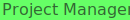

<!-- Improved compatibility of back to top link: See: https://github.com/othneildrew/Best-README-Template/pull/73 -->

<a name="readme-top"></a>

<!-- PROJECT SHIELDS -->

[![Contributors][contributors-shield]][contributors-url]
[![Forks][forks-shield]][forks-url]
[![Stargazers][stars-shield]][stars-url]
[![Issues][issues-shield]][issues-url]
[![MIT License][license-shield]][license-url]
[![LinkedIn][linkedin-shield]][linkedin-url]

<!-- PROJECT LOGO -->
<br />
<div align="center">
  <a href="https://github.com/NinjaSurge/Project-Manager">
    
  </a>

<h3 align="center">Project Manager</h3>

  <p align="center">
    This is a Project manager web ui for programming projects. It creates, reads, updates, and deletes development projects/environments for you in a uniform and customizable way.
    <br />
    <a href="https://github.com/NinjaSurge/Project-Manager"><strong>Explore the docs »</strong></a>
    <br />
    <br />
    <a href="https://github.com/NinjaSurge/Project-Manager">View Demo</a>
    ·
    <a href="https://github.com/NinjaSurge/Project-Manager/issues">Report Bug</a>
    ·
    <a href="https://github.com/NinjaSurge/Project-Manager/issues">Request Feature</a>
  </p>
</div>

<!-- TABLE OF CONTENTS -->
<details>
  <summary>Table of Contents</summary>
  <ol>
    <li>
      <a href="#about-the-project">About The Project</a>
      <ul>
        <li><a href="#built-with">Built With</a></li>
      </ul>
    </li>
    <li>
      <a href="#getting-started">Getting Started</a>
      <ul>
        <li><a href="#prerequisites">Prerequisites</a></li>
        <li><a href="#installation">Installation</a></li>
      </ul>
    </li>
    <li><a href="#usage">Usage</a></li>
    <li><a href="#roadmap">Roadmap</a></li>
    <li><a href="#contributing">Contributing</a></li>
    <li><a href="#license">License</a></li>
    <li><a href="#contact">Contact</a></li>
    <li><a href="#acknowledgments">Acknowledgments</a></li>
  </ol>
</details>

<!-- ABOUT THE PROJECT -->

## About The Project

<!-- [![Product Name Screen Shot][product-screenshot]](https://example.com) -->

<p align="right">(<a href="#readme-top">back to top</a>)</p>

### Built With

- [![React][react.js]][react-url]
- [![NODE][node.js]][node-url]
<p align="right">(<a href="#readme-top">back to top</a>)</p>

<!-- GETTING STARTED -->

## Getting Started

### Setup

#### backend

```sh
cd <Project_Dir>/backend
npm i
```

#### frontend

```sh
cd <Project_Dir>/frontend
npm i
```

### Running

open a terminal for both the frontend and backend directories and run the following commands:

#### Frontend

```sh
cd <Project_Dir>/frontend
npm run dev
```

#### Backend

```sh
cd <Project_Dir>/backend
npm start dev
```

<p align="right">(<a href="#readme-top">back to top</a>)</p>

<!-- USAGE EXAMPLES -->

## Usage

Use this space to show useful examples of how a project can be used. Additional screenshots, code examples and demos work well in this space. You may also link to more resources.

_For more examples, please refer to the [Documentation](https://github.com/NinjaSurge/Project-Manager/wiki)_

<p align="right">(<a href="#readme-top">back to top</a>)</p>

<!-- ROADMAP -->

## Roadmap

We are starting off with Web projects as a base

- [ ] Start Work on backend framework
  - [ ] Make an example Project directory and structure it
  - [ ] basic CRUD for Projects (Start with Creation and Deletion)
- [ ] Start Work on the frontend UI
  - [ ] Make a Project "Home page"

See the [open issues](https://github.com/NinjaSurge/Project-Manager/issues) for a full list of proposed features (and known issues).

<p align="right">(<a href="#readme-top">back to top</a>)</p>

### Goals

- list projects in a folder
- open a code-server Web editor in a project folder when asked
- quick, customizable, projects initialization and creation. (with scripts?)
- quick git aand readme overview of the project
- Remote User-specific access
- Docker Image???

<!-- CONTRIBUTING -->

<!-- NOOOO Clue how I want this handled yet -->

<!-- ## Contributing

Contributions are what make the open source community such an amazing place to learn, inspire, and create. Any contributions you make are **greatly appreciated**.

If you have a suggestion that would make this better, please fork the repo and create a pull request. You can also simply open an issue with the tag "enhancement".
Don't forget to give the project a star! Thanks again!

1. Fork the Project
2. Create your Feature Branch (`git checkout -b feature/AmazingFeature`)
3. Commit your Changes (`git commit -m 'Add some AmazingFeature'`)
4. Push to the Branch (`git push origin feature/AmazingFeature`)
5. Open a Pull Request

<p align="right">(<a href="#readme-top">back to top</a>)</p> -->

<!-- LICENSE -->

## License

Distributed under the MIT License. See `LICENSE.txt` for more information.

<p align="right">(<a href="#readme-top">back to top</a>)</p>

<!-- CONTACT -->

## Contact

NinjaSurge - [@KaehlenR](https://twitter.com/KaehlenR) - rayktd@gmail.com

Project Link: [https://github.com/NinjaSurge/Project-Manager](https://github.com/NinjaSurge/Project-Manager)

<p align="right">(<a href="#readme-top">back to top</a>)</p>

<!-- ACKNOWLEDGMENTS -->

## Acknowledgments

- [NinjaSurge](https://github.com/ninjasurge)

<p align="right">(<a href="#readme-top">back to top</a>)</p>

<!-- MARKDOWN LINKS & IMAGES -->
<!-- https://www.markdownguide.org/basic-syntax/#reference-style-links -->

[contributors-shield]: https://img.shields.io/github/contributors/NinjaSurge/Project-Manager.svg?style=for-the-badge
[contributors-url]: https://github.com/NinjaSurge/Project-Manager/graphs/contributors
[forks-shield]: https://img.shields.io/github/forks/NinjaSurge/Project-Manager.svg?style=for-the-badge
[forks-url]: https://github.com/NinjaSurge/Project-Manager/network/members
[stars-shield]: https://img.shields.io/github/stars/NinjaSurge/Project-Manager.svg?style=for-the-badge
[stars-url]: https://github.com/NinjaSurge/Project-Manager/stargazers
[issues-shield]: https://img.shields.io/github/issues/NinjaSurge/Project-Manager.svg?style=for-the-badge
[issues-url]: https://github.com/NinjaSurge/Project-Manager/issues
[license-shield]: https://img.shields.io/github/license/NinjaSurge/Project-Manager.svg?style=for-the-badge
[license-url]: https://github.com/NinjaSurge/Project-Manager/blob/master/LICENSE.txt
[linkedin-shield]: https://img.shields.io/badge/-LinkedIn-black.svg?style=for-the-badge&logo=linkedin&colorB=555
[linkedin-url]: https://linkedin.com/in/linkedin_username
[product-screenshot]: images/screenshot.png
[react.js]: https://img.shields.io/badge/React-20232A?style=for-the-badge&logo=react&logoColor=61DAFB
[react-url]: https://reactjs.org/
[node.js]: https://img.shields.io/badge/Node-333?style=for-the-badge&logo=nodedotjs&logoColor=#339933
[node-url]: https://nodejs.org/
